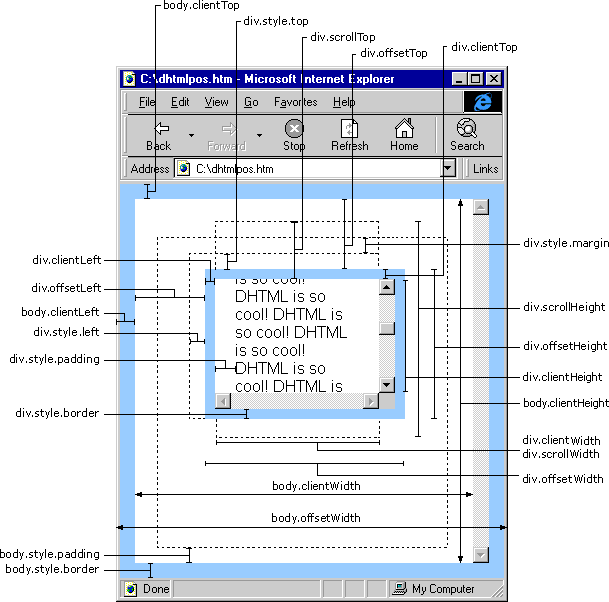

# 滑动到底部无限加载的实现
我们常常会碰到数据条数很多，需要分页显示的情况。对于移动端页面，我们一般会用每次滚动到接近页面底部时，加载更多（下一页）数据的方式。本文就来介绍下滑动到底部无限加载的实现。

实现滑动到底部无限加载，我们要做的是:
* 监听显示数据内容的元素的滚动事件。
* 每次元素滚动时，若此时不在加载数据，则计算元素下方没显示的高度值。如果其值小于我们设定的触发加载的值，则加载，显示更多数据；否则什么都不做。
* 如果没有更多的内容可显示，则不再监视元素的滚动事件。

易知：元素下方没显示的高度值 = 元素总高度 - 元素垂直方向滚动了的距离 - 元素可视区域高度

各种值如下图所示：  


我们可知：
元素的 scrollHeight  属性值为其总高度。  
元素的 scrollTop 属性值为其垂直方向滚动了的距离。  
元素的 clientHeight 属性值为其可视区域高度。  

因此， 元素下方没显示的高度值 = elem.scrollHeight - elem.clientHeight - elem.scrollTop

伪代码如下
```
 // 元素下方没显示的高度值小于TRIGGER_SCROLL_SIZE时，触发滚动
var TRIGGER_SCROLL_SIZE = 50;
var isLoading = false;
// $container 为显示数据内容的元素
$container.scroll(function () {
  if(!isLoading){
    var totalHeight = $container.prop('scrollHeight');
    var scrollTop = $container.scrollTop();
    var height = $container.height();
    if(totalHeight - (height + scrollTop) <= TRIGGER_SCROLL_SIZE){
      isLoading = true;
      // 加载更多数据
      fetchData().done(function(data){
        isLoadind = false;
        if(data.length > 0){
          appendData($container);
        } else {
          // 没有更多数据了。
          $container.off('scroll');
        }
      })
    }
  }
});

```

完整的 Demo 代码见[这里](demo.html)。

注意，如果显示内容的元素为 body，则取其垂直方向滚动了的距离要用 `$(document).scrollTop()`。否则会有兼容性问题。


## 参考
* [html中offsetTop、clientTop、scrollTop、offsetTop各属性介绍](http://blog.csdn.net/fswan/article/details/17238933)
* [关于页面滚动值scrollTop在FireFox与Chrome浏览器间的兼容问题](http://www.cnblogs.com/xxcanghai/p/5015712.html)


## 推荐阅读
* [6 jQuery Infinite Scrolling Demos](http://www.sitepoint.com/jquery-infinite-scrolling-demos/) 无限加载 grid 的列表，文章，图片带分页等。
