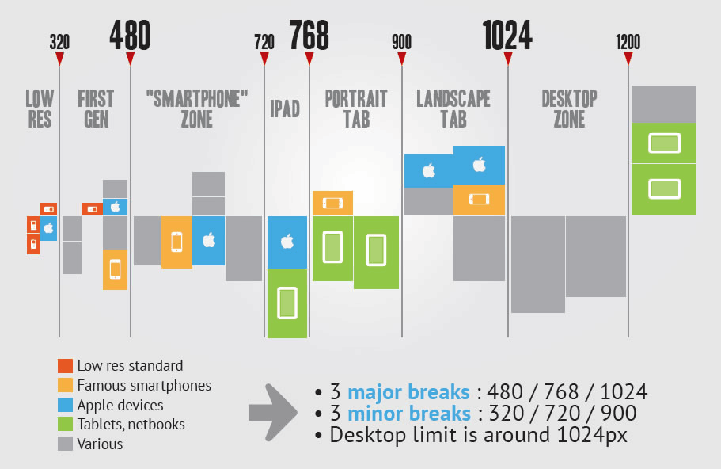

# 响应式布局
对页面进行响应式的设计实现，需要对相同内容进行不同宽度的布局设计，有两种方式：桌面优先（从桌面端开始向下设计）；移动优先（从移动端向上设计）

## 响应式方法
由大屏变成小屏
* 内容的挤压（宽度用百分比）
* 占一整行换行
* 隐藏某些元素

## 常见设备的CSS宽度
主要设置的断点
* 480 普通手机
* 768 ipad
* 1024 普通的平板
* 以上 PC

## 对于常见特定设备的媒体查询
见[这里](media-queries-for-common-device.css)

## 屏幕宽度断点
* JS中的屏幕宽度断点（在某个宽度下执行某个内容）
	* [Importing CSS Breakpoints Into Javascript](https://www.lullabot.com/blog/article/importing-css-breakpoints-javascript)
	* [enquire.js](http://wicky.nillia.ms/enquire.js/) 插件

## 拓展阅读
* [响应式网页设计的9项基本原则](http://www.shejidaren.com/principles-of-responsive-web-design.html)
* [responsivedesign的STRATEGY](http://responsivedesign.is/strategy)
* [Responsive Patterns](http://codepen.io/bradfrost/full/Iardn)

